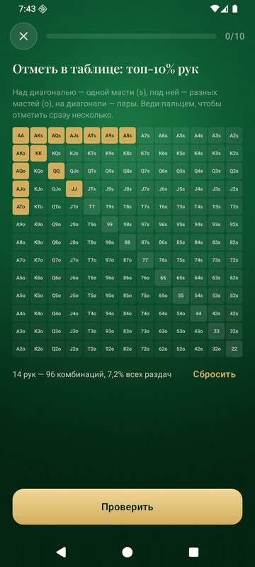
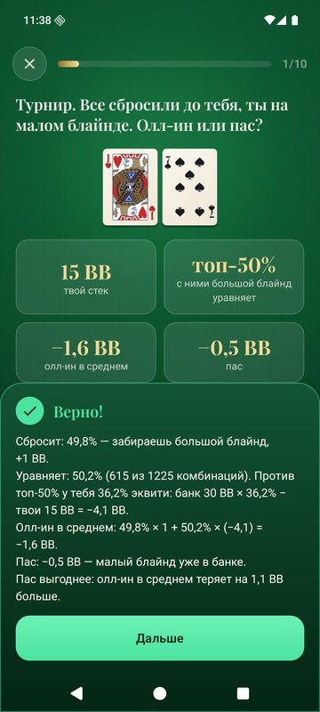
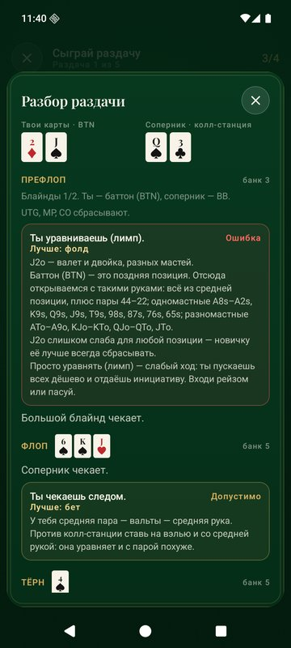
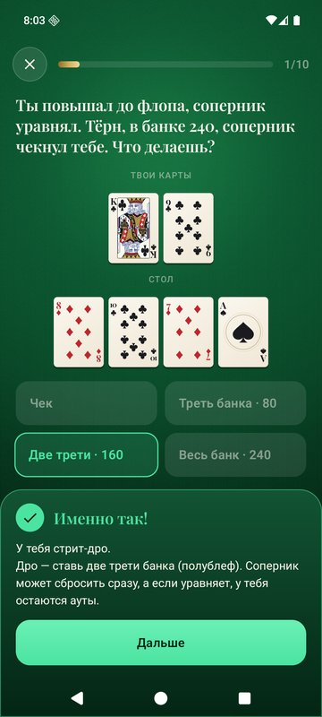
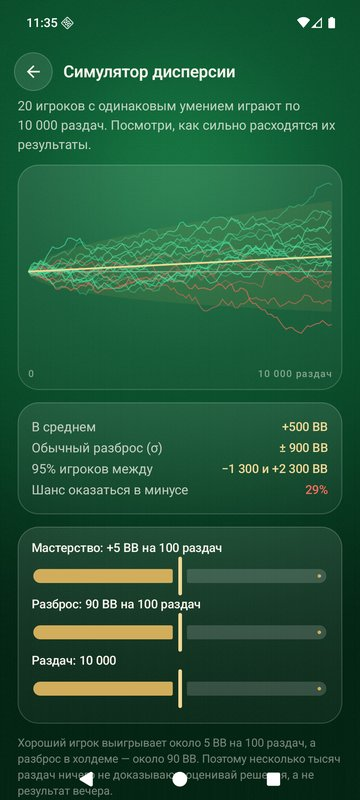
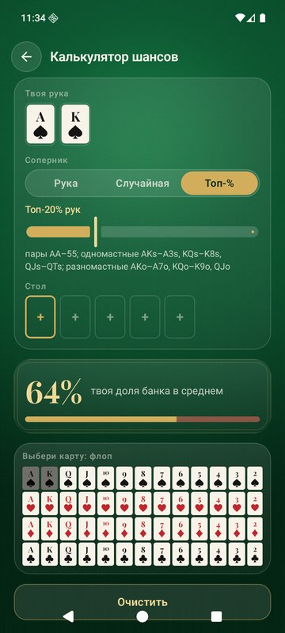
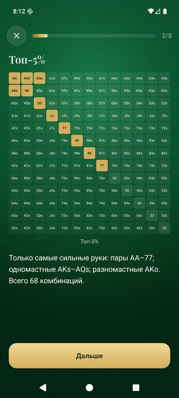

# Масть — тренер покера

Офлайн-приложение для Android, которое учит техасскому холдему с нуля и дальше — до диапазонов, EV и турнирной игры. На русском, без рекламы и интернета, APK весит около 2,5 МБ.

<p>




</p>
<p>




</p>
<p>



</p>

## Что внутри

- **57 уроков в 12 главах**, два уровня.
  - Основы: колода, все 10 комбинаций с ловушками, ход раздачи и позиции, стартовые руки, ауты и шансы банка, стратегия, банкролл и тилт.
  - Уровень 2: диапазоны и комбинаторика, EV и математика блефа, размер ставок, 3-бет и защита блайндов, турниры (пуш-фолд, пузырь, ICM), типы соперников.
- **Экзамен в конце каждой главы**: 8 вопросов, за 6 верных глава получает золотую печать.
- **13 тренажёров с бесконечными раздачами**. Например: «Что за комбинация?», «Шансы банка», «Собери диапазон» (рисуешь пальцем по таблице 13×13), «Пуш или фолд», «Размер ставки», «Математика блефа», «Комбинаторика». Сложность растёт вместе с твоим рейтингом по теме.
- **Симулятор раздачи 6-max**: пять стилей соперников (нит, регуляр, агрессор, колл-станция, маньяк), открытия, лимпы, 3-беты и 4-беты. Тренер оценивает каждое решение с учётом стиля соперника, а после раздачи можно открыть полный разбор.
- **Объяснения пишет движок по реальным картам**. На неверный ответ показывается разбор «почему не так». Все числа и утверждения в текстах проверяются тестами.
- **Мотивация**:
  - XP, уровни от «Новичка» до «Легенды», серия дней, дневная цель;
  - задача дня, три задания недели;
  - рейтинг навыка по каждой теме;
  - 49 ачивок, включая скрытые.
- **Работа над ошибками**: темы, в которых ты ошибся, возвращаются через 1, 3 и 7 дней.
- **Шпаргалка и инструменты**: лестница комбинаций с частотами, словарь, таблица префлопа, ауты и шансы банка. Есть калькулятор шансов (против руки, случайной руки или топ-X%) и симулятор дисперсии.

## Установка и обновление

Скачай `mast-vX.Y.Z.apk` из [Releases](../../releases) на телефон и открой файл. Android попросит разрешить установку из этого источника. Нужен Android 8.0 или новее.

Новую версию ставь поверх старой, не удаляя её: телефон покажет «Обновить», и весь прогресс сохранится. Если удалить приложение, прогресс удалится вместе с ним.

## Сборка

Нужны JDK 21 и Android SDK (platform 37).

```bash
./gradlew :app:testDebugUnitTest   # тесты: движок, контент, объяснения, симулятор, прогресс
./gradlew :app:assembleDebug       # debug-сборка
./gradlew :app:assembleRelease     # релиз; подпись из keystore.properties или MAST_KEYSTORE_PROPERTIES
```

Скриншот-тесты (Roborazzi) пишут картинки в `app/build/screenshots`, если запустить с `-Proborazzi.test.record=true`.

## Устройство

- `core/poker`:
  - карты, оценка руки (лучшие 5 из 7) и быстрый битовый оценщик;
  - вскрытие, ауты, шансы банка, эквити руки и диапазона;
  - 169 классов рук, топ-X% диапазоны, комбинаторика;
  - пуш-фолд, ICM, дисперсия.
- `content`: учебная программа как типобезопасный Kotlin DSL и справочник.
- `practice`:
  - генераторы тренажёров с уровнями сложности, проверка ответов;
  - `Explainer` (объяснения из карт), экзамены и задача дня;
  - симулятор раздачи со стилями соперников и тренером.
- `progress`, `achievements`: прогресс в DataStore, XP, уровни, серия, рейтинг Эло по темам, задания недели, интервальное повторение, ачивки.
- `ui`: Jetpack Compose. Карты, сукно (AGSL-шейдер), фишки, медали и графики нарисованы в Canvas. Растровые картинки есть только у фигур.

Правильность контента держится на тестах:
- полный перебор всех 2 598 960 рук из 5 карт;
- частоты комбинаций из 7 карт на миллионе раздач;
- каждое число в уроках обоих уровней;
- утверждения объяснений на тысячах случайных раздач;
- решения пуш-фолда, перепроверенные точным расчётом;
- тысячи симулированных раздач против всех стилей соперников с проверкой подсчёта фишек;
- загрузка прогресса, сохранённого версией 1.0.0.

## Лицензии

Код — MIT. Фигуры карт — Дмитрий Фомин, [English pattern playing cards](https://commons.wikimedia.org/wiki/Category:SVG_English_pattern_playing_cards), CC0, перекрашены скриптом `art/build_courts.py`. Шрифт Playfair Display распространяется по SIL OFL 1.1.

Приложение только для обучения и без игры на деньги. Игра на деньги допускается только с 18 лет.
