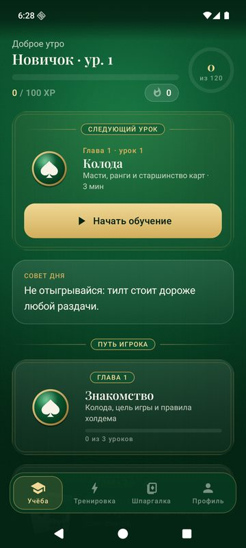
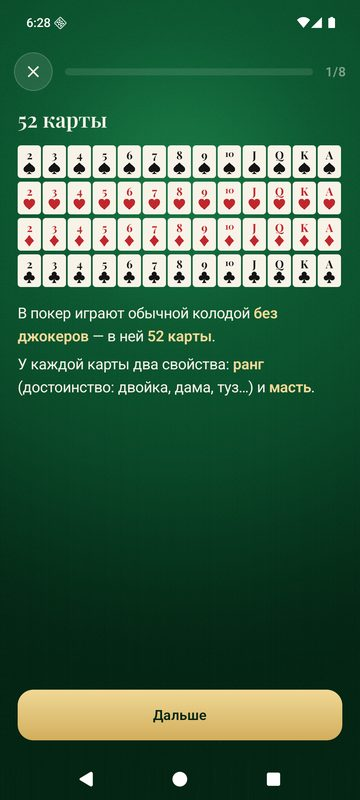
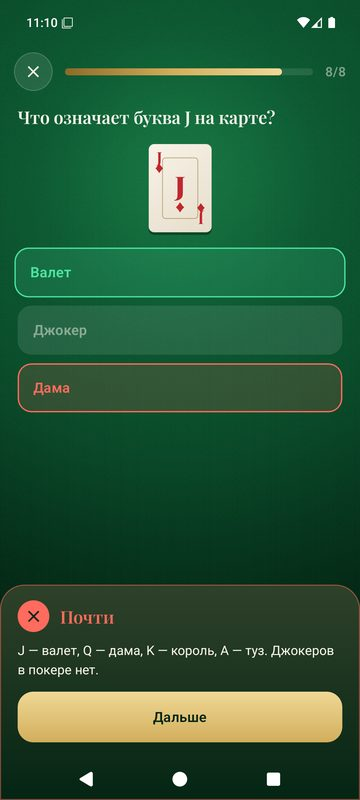
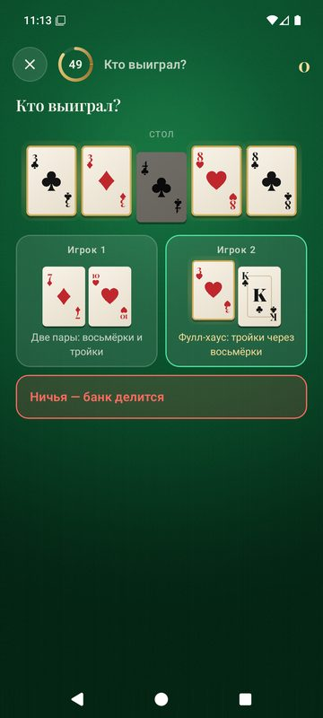
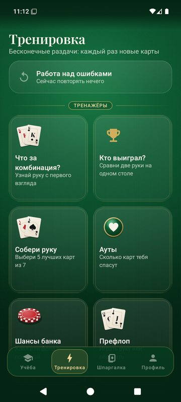
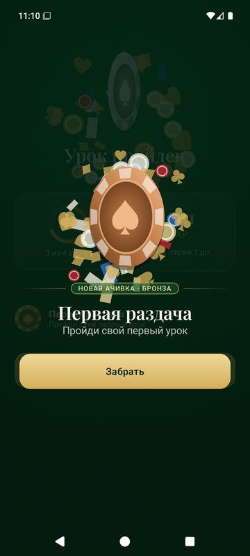
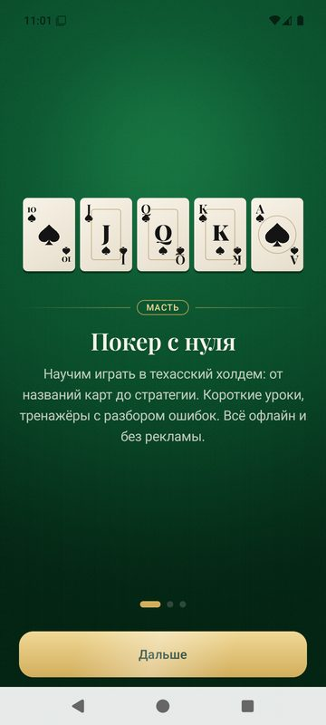
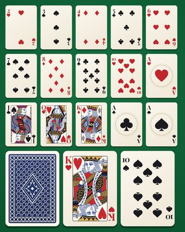

# Масть — тренер покера

Офлайн-приложение для Android, которое учит техасскому холдему с нуля. На русском, без рекламы и интернета, APK весит около 2,5 МБ.

<p>




</p>
<p>




</p>

## Что внутри

- **32 урока в 6 главах**: знакомство с колодой, все 10 комбинаций с ловушками, ход раздачи и позиции, стартовые руки, ауты и шансы банка, стратегия, банкролл и тилт. В каждом уроке есть теория на анимированных картах, «Запомни» и вопросы девяти типов.
- **8 тренажёров с бесконечными раздачами**: «Что за комбинация?», «Кто выиграл?», «Собери руку», «Ауты», «Шансы банка», «Префлоп», «Фаворит?» и «Сыграй раздачу». Последний — симулятор полной раздачи против бота, где каждое решение оценивается и объясняется. У каждого тренажёра есть режимы практики и блица на 60 секунд.
- **Объяснения пишет движок по реальным картам**. На неверный ответ — разбор «почему не так». Все числа и утверждения в текстах проверяются тестами.
- **Работа над ошибками**: темы, в которых ты ошибся, возвращаются через 1, 3 и 7 дней.
- **Мотивация**: XP, уровни от «Новичка» до «Легенды», серия дней, дневная цель и 34 ачивки, включая скрытые.
- **Шпаргалка**: лестница комбинаций с частотами для холдема, словарь, таблица префлопа, ауты и шансы банка.

## Установка

Скачай `mast-vX.Y.Z.apk` из [Releases](../../releases) на телефон и открой файл. Android попросит разрешить установку из этого источника. Нужен Android 8.0 или новее.

## Сборка

Нужны JDK 21 и Android SDK (platform 37).

```bash
./gradlew :app:testDebugUnitTest   # тесты: движок, контент, объяснения, симулятор
./gradlew :app:assembleDebug       # debug-сборка
./gradlew :app:assembleRelease     # релиз; подпись из keystore.properties или MAST_KEYSTORE_PROPERTIES
```

Скриншот-тесты (Roborazzi) пишут картинки в `app/build/screenshots`, если запустить с `-Proborazzi.test.record=true`.

## Устройство

- `core/poker`: карты, оценка руки (лучшие 5 из 7), вскрытие, ауты, шансы банка, эквити, таблица префлопа.
- `content`: учебная программа как типобезопасный Kotlin DSL и справочник.
- `practice`: генераторы тренажёров, проверка ответов, `Explainer` (объяснения из карт) и симулятор раздачи.
- `progress`, `achievements`: прогресс в DataStore, XP, уровни, серия, интервальное повторение, ачивки.
- `ui`: Jetpack Compose. Карты, сукно (AGSL-шейдер), фишки и медали нарисованы в Canvas, растровые картинки есть только у фигур.

Правильность контента держится на тестах:
- полный перебор всех 2 598 960 рук из 5 карт;
- частоты комбинаций из 7 карт на миллионе раздач;
- каждое число в уроках, а также утверждения объяснений на тысячах случайных раздач;
- 4000 симулированных раздач с проверкой подсчёта фишек.

## Лицензии

Код — MIT. Фигуры карт — Дмитрий Фомин, [English pattern playing cards](https://commons.wikimedia.org/wiki/Category:SVG_English_pattern_playing_cards), CC0, перекрашены скриптом `art/build_courts.py`. Шрифт Playfair Display распространяется по SIL OFL 1.1.

Приложение только для обучения и без игры на деньги. Игра на деньги допускается только с 18 лет.
